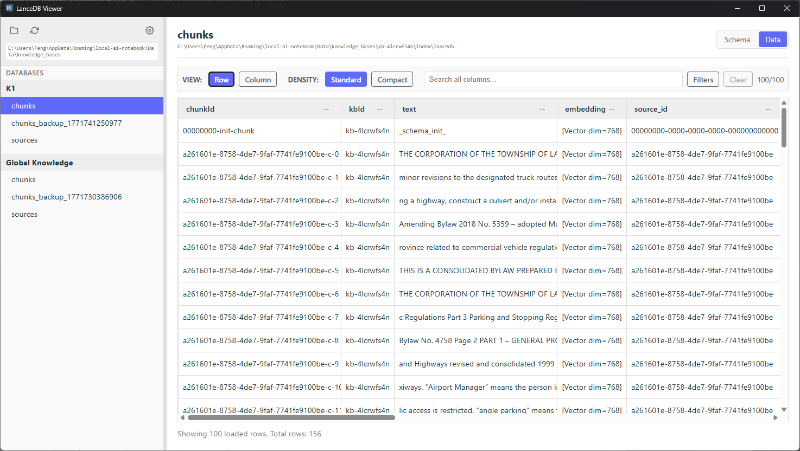

# LanceDB Viewer (Windows MVP)

A lightweight desktop app that helps you quickly find, open, and understand your LanceDB files without writing scripts.

## Project Showcase

- Repository: [wufeng1740/lanceDB-viewer](https://github.com/wufeng1740/lanceDB-viewer)
- Latest Release: [Download from GitHub Releases](https://github.com/wufeng1740/lanceDB-viewer/releases/latest)
- Best for: people who want to inspect LanceDB content fast and safely

## App Screenshot



## MVP scope

- Scan a folder and automatically find all LanceDB datasets.
- Browse databases and tables in a clear list.
- View table fields and vector basics at a glance.
- Reopen quickly from your last used folder.
- Read-only experience by design, so you can explore with confidence.

## Not in MVP

- No write/edit/export actions.
- No Node sidecar.
- No progress/cancel UI yet (Phase 2 candidate).

## Development

1. Install dependencies:
   - Node.js 20+
   - Rust stable toolchain
2. Install frontend deps:
   - `npm install`
3. Run app:
   - `npm run dev`
   - In another shell: `cargo tauri dev`

## Building

```bash
npm run tauri build
```

### Low Memory Build (Fix for 0xc000012d error)

If you encounter memory errors during build, use this PowerShell command to limit parallelism:

```powershell
$env:CARGO_BUILD_JOBS=2; npm run tauri build
```

(Run this from the project root)

## Tests

- Frontend smoke:
  - `npm test`
- Rust unit tests:
  - `cargo test` (inside `src-tauri/`)

## Known limits

- Large recursive scans may be slow.
- Some row counts and vector dimensions may be unavailable and shown as unknown.
- Permission-restricted folders are skipped with warnings.

## License

This project is licensed under the **GNU General Public License v3.0 (GPL-3.0)**.

- Full text: [LICENSE](./LICENSE)
