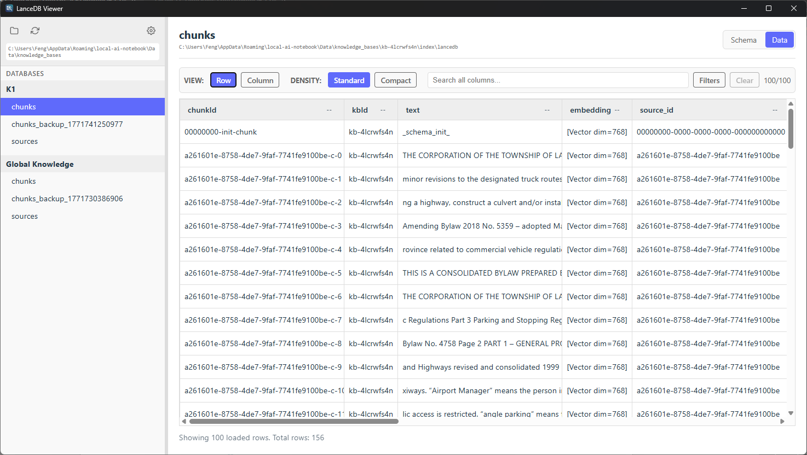

# LanceDB Viewer

**A read-only desktop viewer for inspecting LanceDB datasets in seconds.**

[Download Latest Release](https://github.com/wufeng1740/lanceDB-viewer/releases/latest)  
[Watch 30s Demo](./docs/demo-script.md)  
[Try It With Sample Data](./docs/sample-data.md)



LanceDB Viewer is for AI and RAG developers who need to inspect local LanceDB data without writing throwaway scripts. Open a folder, scan the datasets inside it, and check schema, rows, vector fields, and mapped knowledge-base names from a desktop UI.

## Why This Exists

Use LanceDB Viewer when you need to:

- Check what actually landed in LanceDB after an ingestion or indexing run.
- Confirm schema, row count, and vector dimension before debugging retrieval quality.
- Understand folders with UUID-like names by mapping them to human-readable knowledge-base labels.

## What It Does

- Scan a folder and discover LanceDB datasets automatically.
- Browse databases and tables from a single sidebar.
- Inspect schema fields, row counts, and vector metadata.
- Preview the first 100 rows of table data.
- Load a JSON mapping file to rename internal folder IDs in the UI.
- Reopen the last scanned folder on next launch.

## Why Not Scripts

Ad-hoc Python or notebook scripts work, but they add friction:

- You have to write or update code every time you want to inspect a new dataset.
- Browsing multiple tables is slower than clicking through a UI.
- Sharing the inspection flow with teammates is harder if it depends on local scripts.

LanceDB Viewer keeps the workflow simple: open, inspect, verify, close.

## Safety And Scope

LanceDB Viewer is intentionally read-only.

- No write, edit, or delete actions.
- No export actions in the current MVP.
- No progress or cancel UI for long scans yet.

This is an inspection tool, not a database management suite.

## Quick Start

1. [Download the latest release](https://github.com/wufeng1740/lanceDB-viewer/releases/latest).
2. Launch the app.
3. Choose the root folder that contains your LanceDB datasets.
4. Select a table to inspect its schema or data preview.

If you do not have your own dataset ready yet, start with the sample-data guide in [docs/sample-data.md](./docs/sample-data.md).

## Who It Is For

- AI / RAG developers debugging local knowledge-base pipelines
- Developers using LanceDB as a vector store and needing a quick inspection tool
- Anyone who wants a safer read-only way to browse LanceDB contents

## Current Limits

- Large recursive scans may be slow.
- Some row counts and vector dimensions may be unavailable and shown as unknown.
- Permission-restricted folders are skipped with warnings.
- The current UX is optimized for inspection, not batch operations.

## Feedback

If you try the app, the most useful feedback is specific:

- What kind of LanceDB data were you inspecting?
- Which step felt slow, unclear, or missing?
- What is the next capability you want most?

[Open a Discussion](https://github.com/wufeng1740/lanceDB-viewer/discussions)  
[Report a Bug](https://github.com/wufeng1740/lanceDB-viewer/issues/new/choose)  
[Share Your LanceDB Use Case](https://github.com/wufeng1740/lanceDB-viewer/discussions)

## Development

1. Install dependencies:
   - Node.js 20+
   - Rust stable toolchain
2. Install frontend dependencies:
   - `npm install`
<<<<<<< HEAD
3. Run app:
   - `npm run tauri dev`
=======
3. Run the frontend:
   - `npm run dev`
4. In another shell, run the desktop app:
   - `cargo tauri dev`
>>>>>>> codex/growth-assets-setup

## Build

```bash
npm run tauri build
```

If you hit Windows memory pressure during build:

```powershell
$env:CARGO_BUILD_JOBS=2; npm run tauri build
```

## Test

- Frontend smoke: `npm test`
- Rust unit tests: `cargo test` inside `src-tauri/`

## License

Licensed under **GPL-3.0**. See [LICENSE](./LICENSE).
